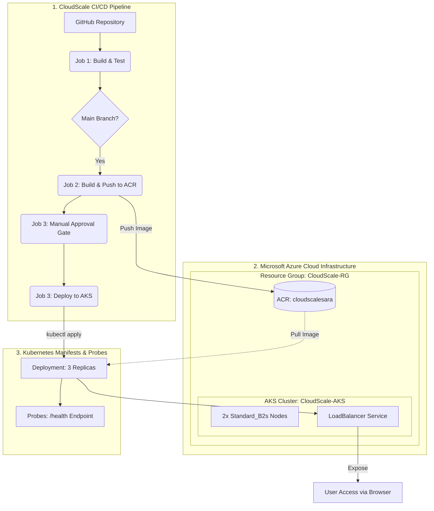

# CloudScale Project - Cloud Computing & DevOps Engineering Course

### 1. Student names and IDs
* **Tasneem Khaled Aldernawi — Student ID: 4890**
* **Fatima Alzahraa Mohammed — Student ID: 4999**
* **Sara Beleid Elhoty — Student ID: 4939**

### 2. Project Title and Description
**CloudScale** is a containerized web application deployment solution designed for modern, scalable infrastructure. This project automates the entire software delivery lifecycle on Microsoft Azure, leveraging enterprise-grade DevOps practices to ensure security, high availability, and repeatable infrastructure.

 #### Key Features & Implementation
* **Containerized Web App:** A custom application featuring a /health endpoint for Kubernetes liveness and readiness monitoring, showcasing the team: Fatima, Tasneem, and Sara.

* **Infrastructure as Code (IaC):** Dynamic provisioning of a complete Azure environment (Resource Group, ACR, and AKS) using Terraform, featuring a 2-node cluster (Standard_B2s instances).

* **Automated CI/CD Pipeline:** A robust GitHub Actions workflow that automates the transition from source code to production, including automated Docker builds, ACR image pushes, and Kubernetes manifest deployment.

* **Secure Azure Integration:** Seamless cluster-to-registry communication using native AcrPull role mapping, eliminating the need for manual image pull secrets.

* **Production-Grade Security:** Implementation of a Manual Approval Gate via GitHub production environments, ensuring all deployments are verified before reaching the live cluster.

* **Secure Authentication:** Streamlined Azure resource management via Service Principals configured securely as repository secrets.


## 3. Architecture Diagram

### 4. Application Containerization & Kubernetes Deployment

developing the web application, containerizing it with Docker, and preparing the Kubernetes manifests for deployment to Azure Kubernetes Service (AKS).

## Docker Instructions:

### 1. Build the Docker Image
 Builds the Docker image from the Dockerfile.
```bash
docker build --no-cache -t cloudscale-app .
```

### 2. Run the Container Locally
Runs the application locally and maps port 8080 on the host to port 5000 inside the container.
```bash
docker run --rm -p 8080:5000 cloudscale-app
```

### 3. Verify the Health Endpoint
Verifies that the application is running correctly and returns a 200 OK response.
```bash
curl http://localhost:8080/health
```
## Terraform Instructions: 
### 1. Initialize the Directory
Initialize the working directory containing Terraform configuration files. This downloads the necessary provider plugins.
```bash
terraform init
```
### 2. Validate configuration
The terraform validate command validates the configuration files in a directory.   
```bash
terraform validate
```

### 3. Generate an Execution Plan
Create an execution plan, letting you preview the cloud infrastructure changes Terraform will make before applying them.
```bash
terraform plan
```
### 4. Apply the Configuration
Build or change the cloud infrastructure according to the configuration files.
```bash
terraform apply
```

## Kubernetes Deployment Instructions:

### 1. Apply the Deployment Manifest
```bash
kubectl apply -f k8s/deployment.yaml
```

### 2. Creates the Kubernetes Deployment with three replicas.
Apply the Service Manifest
```bash
kubectl apply -f k8s/service.yaml
```

### 3. Creates a LoadBalancer Service to expose the application externally.
Verify the Cluster Nodes, checks that all AKS worker nodes are in the Ready state.
```bash
kubectl get nodes
```

### 4.Verify the Services
Displays the Kubernetes services and the assigned External IP for accessing the application.
```bash
kubectl get service
```


## 5. Github Actions Workflow Explanation

Our CI/CD pipeline is designed around a professional, production-grade automation strategy. It separates build verification from deployment, ensuring that no containerized application reaches our Kubernetes cluster without passing automated tests and receiving manual authorization.

### Pipeline Triggers
The workflow is fully automated and monitors two specific event types:

1. **Pull Requests to `main`:** Triggered when team members propose new code changes, initiating a dry-run build and test sequence.
2. **Pushes to `main`:** Triggered automatically upon merge, executing the full build, push, and deployment lifecycle.
---
### Inside the Pipeline: The Three Core Jobs
#### 1. The Verification Phase (Build & Test)
* **When it runs:** On every push or pull request to main.
* **What it does:** It spins up a fresh Ubuntu runner, clones the repository, and initializes the Docker Buildx environment. It then executes a local Docker build to verify that the application containerizes correctly.
* **The Goal:** This acts as a gatekeeper, ensuring that only valid, stable code that passes containerization tests can proceed to the registry phase.

#### 2. The Registry Phase (Push to ACR)
* **When it runs:** Only when code is merged or pushed to the main branch.
* **What it does:** The pipeline authenticates securely with Azure using stored GitHub Secrets and logs into our private Azure Container Registry (cloudscalesara.azurecr.io). It builds the production image and pushes it to the registry using two specific tags: the commit SHA (for version tracking) and the latest tag (for deployment).
* **The Goal:** To maintain an immutable, versioned history of every successful build, ensuring we have a reliable image ready for deployment at all times.

#### 3. The Deployment Phase (Deploy to AKS)
* **When it runs:** Triggered automatically after a successful push to the registry.
* **What it does:** This job maps to our protected production environment, which activates a Manual Approval Gate. Once a team member reviews and clicks Approve, the pipeline retrieves the AKS cluster context and executes kubectl apply -f k8s/.
* **The Goal:** To ensure a safe, authorized transition from the registry to the live cluster. This triggers a rolling update, pulling the latest image from ACR to ensure the application stays updated with zero-downtime.
